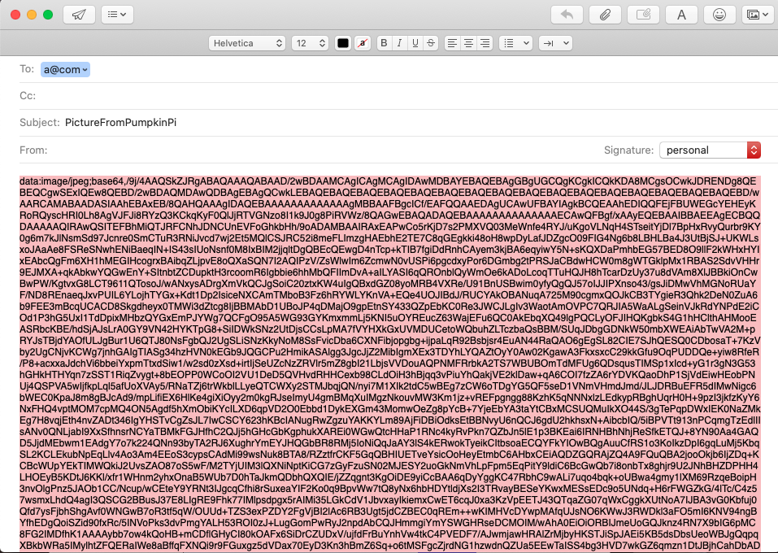

# Pumpkin Pi

## Webpage Demo -> [Link](https://pumpkin-pi.herokuapp.com/)

An interactive Jack-o-lantern powered by raspberry pi, that will play a spooky sound whenever it detects someone walks by and take a picture of whom it scares.
Later on, the picture will be uploaded onto a website, like a photo booth of the roller coaster.

## Instruction

- Open two terminals and cd to the where the project file is
- Run the command below in one terminal to fire up the pumpkin pi device.  

  ``` terminal command
  python pumpkinPi.py
  ```

- In another terminal, run the command below to set up the photobooth

  ``` terminal command
  docker build -t pumpkinpi .
  docker run -p 5000:5000 --rm --name flask-container pumpkinpi
  ```

- Enjoy the PumpkinPi and check your photo here: [http://localhost:5000/](http://localhost:5000/)

### Pumpkin Pi Photo Booth


### Send Picture to yourself


_Enter your email and click 'Send'_


_Copy the URI Code_


_Paste the Code on a Browser_


_There You Have It!_

## About the Hardware

### Equipment List

- Raspberry Pi 4
- Breadboard
- Breadboard wires
- HC-SR04 Ultrasonic Sensor
- Resistor 1k & 2k
- Picamera Module

I followed the tutorial form [here](https://pimylifeup.com/raspberry-pi-distance-sensor/),to wire the sensor up with the raspberry Pi


## Copyright

- All the sound effects are from [SoundBible.com](http://soundbible.com/)
- Icons made by <a href="https://www.flaticon.com/authors/freepik" title="Freepik">Freepik</a> from <a href="https://www.flaticon.com/" title="Flaticon"> www.flaticon.com</a>
